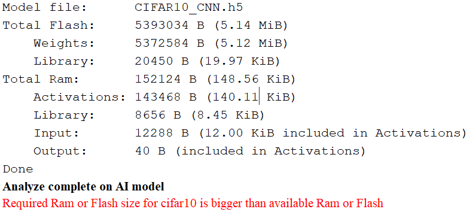
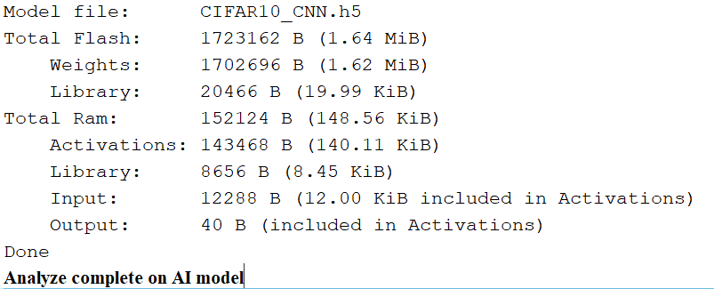
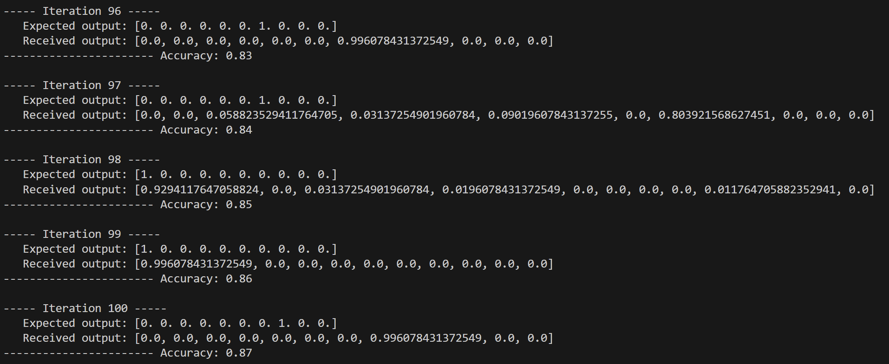
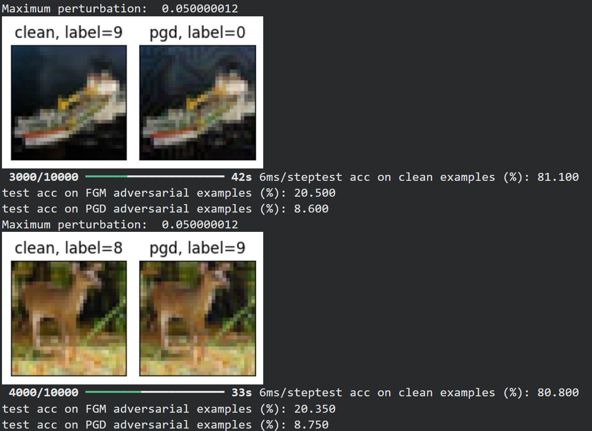
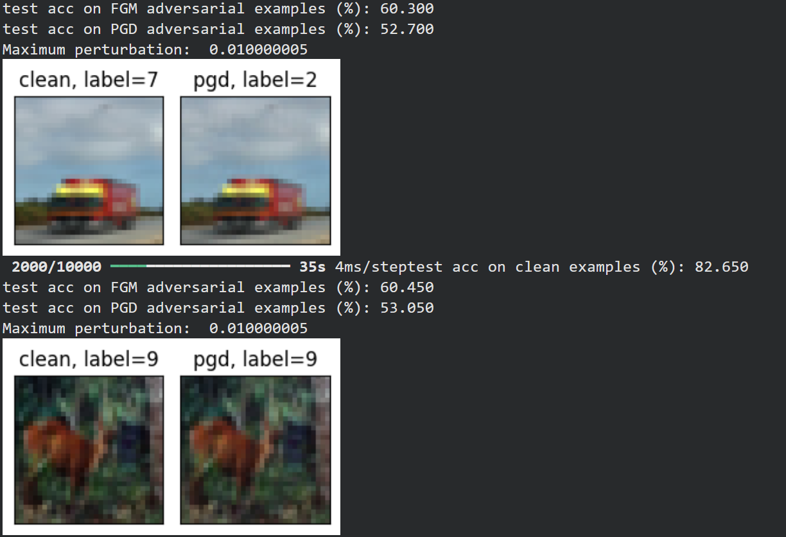
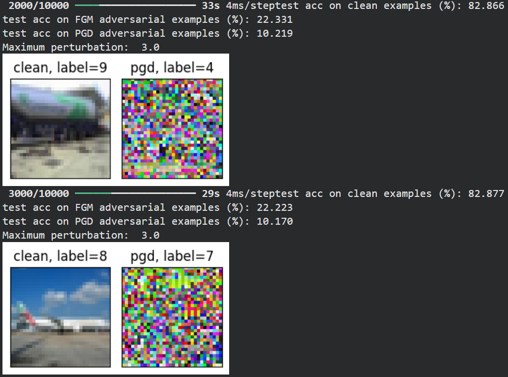
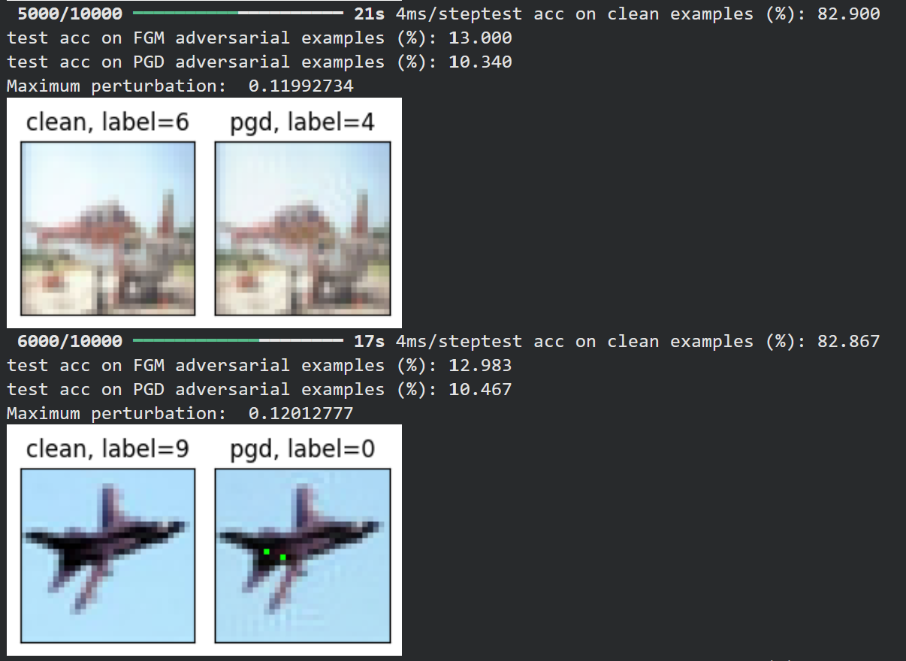
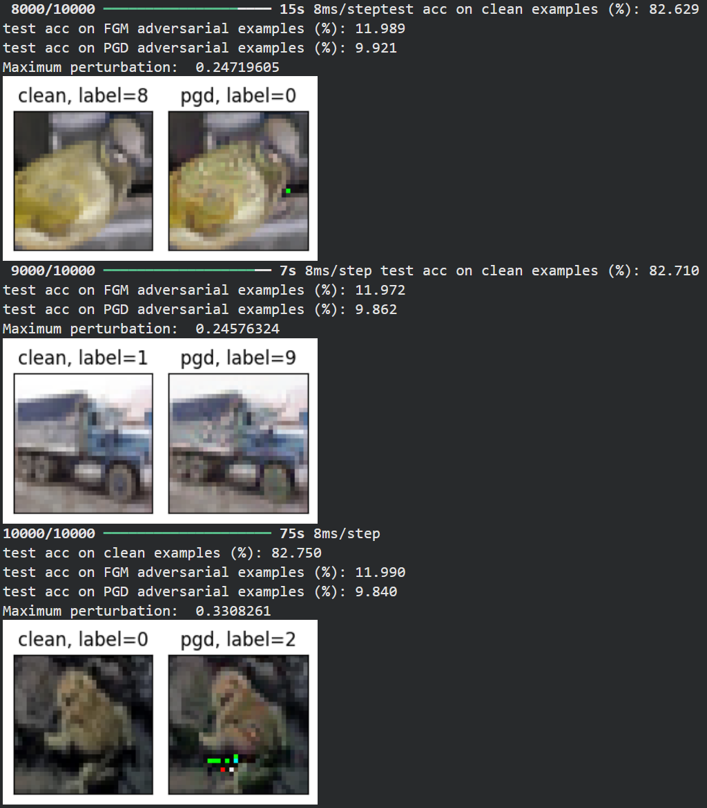
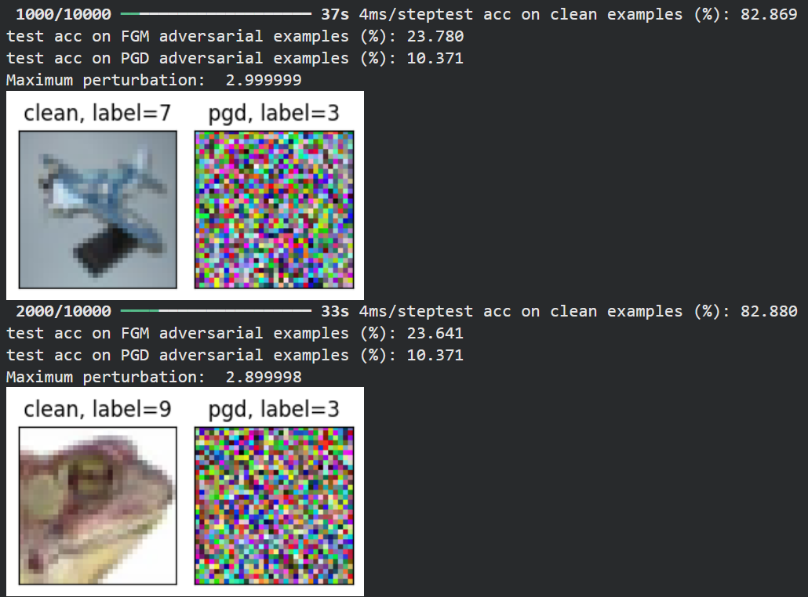
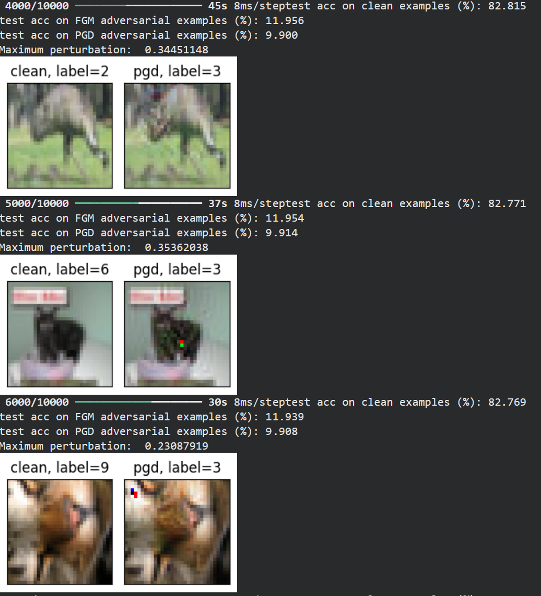

# Déploiement d’un Réseau de Neurones Profond sur Microcontrôleur

Le but de ce projet est le déploiement d’un réseau de neurones profonds préentraîné sur le dataset CIFAR-10 pour une application de classification d’images. L’objectif principal est d’adapter ce modèle afin de le rendre embarquable sur un microcontrôleur en respectant les contraintes inhérentes aux systèmes embarqués : capacité de stockage, puissance de calcul réduite etc.

### Prérequis

- **Python** à jour
- **STM32CubeIDE** installé (avec le pack **X-CUBE-AI**)  
- Une carte **STM32L4R9 Discovery Kit**
- Les bibliothèques Python nécessaires (numpy, pyserial, etc.)  

### Installation 

```bash
gh repo clone TheoMaillot/embedded_ia_3A
```

### Utilisation 

1. Décrompresser dataset.rar pour extraire les deux fichiers .npy
2. Ouvrir le fichier serial_evaluation.py et renseigner vos propres chemins d'accès aux fichiers .NPY [ligne 87 et 88](https://github.com/TheoMaillot/embedded_ia_3A/blob/main/serial_evaluation.py#L87-88)
3. Brancher la carte et renseigner votre port COM [ligne 5](https://github.com/TheoMaillot/embedded_ia_3A/blob/main/serial_evaluation.py#L5)
4. Décompresser [IA_Embeded.rar](./STM32cubeide-project/IA_Embeded.rar) et ouvrir le projet avec Cube Ide
5. Dans X-CUBE-AI puis dans cifar10, ajouter votre fichier .h5 dans Model, et vos 2 fichier .npy dans Validation inputs et Validation outputs
6. Appuyer sur Run
7. Exécuter le fichier serial_evaluation.py

---

## 1. Analyse du modèle existant

Le modèle proposé est basé sur VGG11 mais adapté aux images 32×32 de CIFAR-10, avec une architecture progressive (32→64→128 filtres) qui réduit la taille à 16 Mo contre 528 Mo pour VGG11 classique. Il est composé de convolutions 3×3 avec ReLU, du Batch Normalization pour stabiliser l'entraînement, et une régularisation par SpatialDropout2D (0.25) dans les blocs convolutionnels et Dropout (0.3) dans les couches denses (1024→512→10 neurones). 

Nous avons testé ce modèle avant de commencer à le modifier, et nous atteignions 83% d'accuracy et 53% de loss. Ainsi, les performance de ce modèle sont correctes, et par la suite, nous essaierons de les concerver le mieux possibles tout en optimisant la taille de notre modèle.

---

## 2. Étude du microcontrôleur cible

Pour ce projet nous avions à notre disposition la carte STM32L4R9 Discovery Kit. Les principales caractéristiques à prendre en compte lors du choix de la carte sont la mémoire Flash, sur laquelle sera stocké le modèle, et la mémoire RAM qui effectuera les calculs du modèle.

Dans notre cas, la datasheet nous fournit les caractéristiques suivantes : une mémoire Flash de 2 Mo et une RAM de 640 Ko. La mémoire RAM devrait être suffisante, même si l'on risque d'observer plusieurs secondes d'inférence par image. Par contre, la Flash est insuffisante au vu de la taille actuelle de notre modèle (16 Mo). 

---

## 3. Évaluation de l’embarquabilité du modèle initial

Pour vérifier l'embarquabilité de notre modèle, nous avons créé un projet CubeIde pour notre carte, et analyser notre modèle avec STM32CubeAI. Voici les résultats obtenus :



Comme prévu, la Flash est insuffisante pour contenir notre modèle : ce dernier doit occuper 5.14 Mo d'espace pour être implémenter, alors que notre carte n'en compte que 2 Mo. 
Par contre, sans modification, la RAM necessaire au fonctionnement du programme n'est que de 148 Ko, ce qui est bien inférieur à ce que la carte possède.

---

## 4. Les solutions pour rendre le modèle embarquable

### a. Compression du modèle

Une première solution pour rendre le modèle embarquable, est de le compresser. Ceci est directement possible avec STM32CubeAI, qui propose 3 modes de compression : low, medium et high. Voici les résultats pour le mode *high*:



Après compression, la taille du modèle est siffisamment réduite pour pouvoir être stocké dans la Flash, le rendant ainsi embarquable. Cette méthode fonctionne aussi pour le mode *medium*, mais pas pour le mode *soft*.

### b. Création d'un modèle plus léger

La deuxième solution consiste à créer un tout nouveau modèle. Pour cela, nous avons modifié directement le fichier [train.py](./train.py) du modèle pour diminuer sa taille. 

A COMPLETER !!!!!

---

## 5. Intégration dans un projet embarqué

La dernière étape du développement du projet consistait à intégrer notre modèle dans la carte. Pour cela, nous avons erécupéré notre nouveau fichier h5 et l'avons implémenté via CubeIde. Il faut ensuite entraîner le modèle directement sur la carte.

### a. Partie Python : envoi des datas vers la carte et évaluation

Le fichier [serial_evaluation.py](./serial_evaluation.py) gère la communication série entre notre PC et la carte : il synchronise l'UART, envoie des entrées (X_test) sous forme de floats 32, lit les sorties retournées par le STM32, compare les prédictions aux labels (Y_test) et calcule l'exactitude sur un nombre d'itérations donné.

Lors de nos premiers tests avec ce code, nous avons remarqué que nous ne recevions rien de la carte (*ValueError: attempt to get argmax of an empty sequence*). Nous avons donc rajouté un *time.sleep(5)* à la [ligne 75](https://github.com/TheoMaillot/embedded_ia_3A/blob/main/serial_evaluation.py#L75) dans la fonction *evaluate_model_on_STM32*, après avoir envoyé les inputs, afin de laissé du temps de calcul à la carte. Ceci s'explique par la taille de la RAM du STM32L4R9, qui n'est pas assez importante pour réaliser les calculs aussi vite que sur notre ordinateur.

---

### b. Partie embarquée : réception des data et entrainement 

L'ajout de STM32CubeAI rajoute de nombreux fichiers, notamment le fichier [app_x-cube-ai.c](./STM32cubeide-project/app_x-cube-ai.c). Il utilise le framework de STM32CubeAI pour exécuter notre modèle embarqué. Nous avons complété le programme pour gèrer la communication UART pour recevoir les images envoyées par le code python, les transmetre au réseau de neurones pour classification et enfin renvoyer les probabilités des 10 classes via UART à notre PC.

---

## 6. Évaluation des performances sur cible

Après avoir généré un nouveau fichier .h5 de taille réduite, nous l'avons implémenté dans la cible via CubeIde.
L'exécution de notre programme *serial_evaluation.py* nous donne les résultats suivant :



### Performance
- **Accuracy**: 87% sur 100 itérations
- **Temps d'inférence**: ~6 secondes par image (10 minutes pour 100 inférences)

### Analyse des résultats
- L'exactitude obtenue sur la cible est comparable aux performances du modèle sur PC (83%)
- Le temps d'inférence relativement long s'explique par les contraintes matérielles :
  - Vitesse de calcul limitée du microcontrôleur à cause de la RAM
  - Temps de communication UART entre PC et carte

Ces résultats démontrent que notre modèle optimisé fonctionne efficacement sur la cible.

---

## 7. Attaques avec Projected Gradient Descent (PGD)

### Description

Cette section présente une étude des attaques utilisant la fonction `projected_gradient_descent()` avec deux normes différentes : **L2** et **L∞**. Ces attaques permettent de tromper les modèles de classification d'images de manière ciblée ou non ciblée.

### a. Principe des normes

La fonction `projected_gradient_descent()` accepte deux normes qui définissent différentes stratégies d'attaque :


| Norme   | Caractéristiques                                                                                 | Usage                                     |
| --------- | --------------------------------------------------------------------------------------------------- | ------------------------------------------- |
| **L∞** | Limite la perturbation maximale par pixel (tous les pixels modifiés uniformément jusqu'à ±ε) | Attaques discrètes et uniformes          |
| **L2**  | Limite la norme euclidienne totale (quelques pixels peuvent avoir de grandes perturbations)       | Attaques concentrées sur certains pixels |

---

### b. Attaques non ciblées

Les attaques non ciblées visent simplement à tromper le modèle sans contrôler la classe prédite en sortie.

#### Norme L∞

##### Configuration de base

```python
adv_perturbation_budget = 0.05  # epsilon
pgd_iterations = 40
pgd_step_budget = 0.01          # step size
```

**Résultats :**

- Efficacité : 10 images trompées sur 10
- Discrétion : Quelques rayures légères sur images 32×32, mais attaque peu visible



##### Configuration inefficace (pas trop grand)

Si le pas (step) a la même valeur que l'epsilon, les chances de succès chutent drastiquement. Le gradient "rebondit" aux frontières de la contrainte L∞ sans converger efficacement.



##### Epsilon trop élevé

La norme L∞ nécessite obligatoirement un epsilon faible pour rester discrète. Si tous les pixels dérivent d'une valeur forte, l'image devient un nuage de couleurs chaotiques.



> **Note :** Epsilon = 3 pour L∞ sur des images normalisées [0,1] est excessivement élevé

---

#### Norme L2

##### Principe

La norme L2 permet de modifier quelques pixels avec un grand écart de couleur. Elle nécessite donc un epsilon plus grand que L∞ pour être efficace.

##### Discrétion selon la résolution


| Résolution | Visibilité     | Explication                                            |
| ------------- | ----------------- | -------------------------------------------------------- |
| 32×32      | Visible         | Les pixels modifiés sont clairement identifiables     |
| 2048×2048  | Quasi-invisible | Les modifications sont imperceptibles à l'œil humain |

##### Configuration 1 : Epsilon modéré

```python
adv_perturbation_budget = 1.2
pgd_step_budget = 0.05
```

**Observation :** Les pixels sont modifiés mais pas suffisamment pour être catégorisés comme attaque par un humain. Pourtant, la prédiction est fausse.



##### Configuration 2 : Epsilon élevé

```python
adv_perturbation_budget = 3
pgd_step_budget = 0.05
pgd_iterations = 75
```

**Observation :** Beaucoup plus de pixels modifiés en raison de l'epsilon plus grand.



---

### c. Attaques ciblées

Contrairement aux attaques non ciblées, les attaques ciblées forcent le modèle à prédire une **classe spécifique** (dans notre cas : classe 3).

#### Implémentation

Pour réaliser une attaque ciblée, deux modifications sont nécessaires :

1. **Spécifier la classe cible :**

```python
   target_class = 3  # Classe vers laquelle orienter l'attaque
```

2. **Modifier l'appel de la fonction :**

```python
   projected_gradient_descent(..., targeted=True, target_label=target_class)
```

#### Résultats avec les deux normes

##### Norme L∞



##### Norme L2



#### Observation

Les deux normes conservent leurs spécificités respectives, mais cette fois-ci **la prédiction en sortie est bien la classe demandée (classe 3)**.

---

### d. Bilan des attaques


| Type d'attaque | Norme | Epsilon optimal | Avantages                   | Inconvénients                  |
| ---------------- | ------- | ----------------- | ----------------------------- | --------------------------------- |
| Non ciblée    | L∞   | Faible (0.05)   | Discrète, uniforme         | Nécessite epsilon très faible |
| Non ciblée    | L2    | Élevé (1.2-3) | Efficace sur grandes images | Visible sur petites images      |
| Ciblée        | L∞   | Faible-Moyen    | Contrôle de la classe      | Convergence plus difficile      |
| Ciblée        | L2    | Élevé         | Contrôle de la classe      | Modifications visibles          |

---

## 8. Conclusion

---
